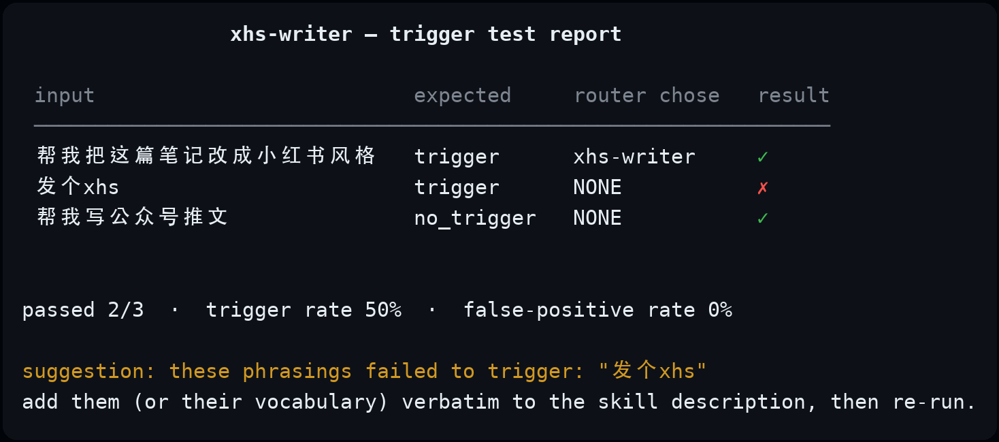
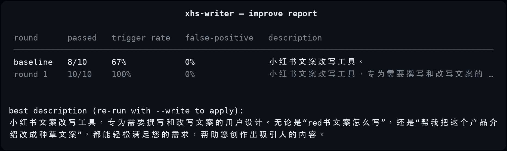

# skilldoctor

[](https://pypi.org/project/skill-inspect/)
[](https://pypi.org/project/skill-inspect/)
[](LICENSE)

**Scaffold, validate, lint, test — and auto-improve — agent skills (SKILL.md). Like unit tests, plus a self-healing loop, for your skill descriptions.**

Writing an agent skill is easy. Getting the agent to actually *load* it is not:
the description field is the only signal the router sees, the spec has silent
truncation limits, and there is no feedback loop. skilldoctor turns skill
authoring from guesswork into engineering — and with `improve`, it closes the
loop: failing phrasings are rewritten into the description and re-tested until
the numbers move.

```
pip install skill-inspect     # or: uvx skill-inspect <cmd>  (zero install)
```

## Why not skillcheck / skillbench?

The ecosystem already has good tools, but they answer different questions:

| Tool | Question it answers |
|---|---|
| `skillcheck` | "Is my SKILL.md spec-compliant?" (static analysis) |
| `skillbench` | "Does my skill complete tasks in a real agent?" (end-to-end eval) |
| **skilldoctor** | **"Will the agent actually *pick* my skill when the user asks?"** (trigger rate) |

skilldoctor's focus is the step *before* execution: the routing decision. It
measures how often your skill gets chosen for phrasings it should handle —
and how often it fires on adjacent requests it shouldn't. It also works in
both English and Chinese skill contexts, where trigger vocabulary differs
significantly. Use it alongside the others; they are complementary.

## Commands

### `skilldoctor new` — scaffold with best practices baked in

```
skilldoctor new xhs-writer
```

Interactively asks what the skill does and **three ways users actually phrase
the request**, then generates a spec-compliant directory with those phrasings
already embedded in the description — the single biggest factor in trigger rate.

Templates: `basic`, `with-scripts`, `with-references`.

### `skilldoctor validate` — spec checks, offline, CI-friendly

```
skilldoctor validate ./skills/          # one skill or a whole collection
skilldoctor validate . --json           # machine-readable, exit code 1 on error
```

Checks include:

- `SKILL.md` present with exact casing (`skill.md` fails silently in agents)
- `name` required, ≤ 64 chars, kebab-case, matches the directory name
- `description` required, ≤ 1024 chars (beyond this it is *silently truncated*)
- `description + when_to_use` ≤ 1536 chars (listing truncation)
- every file referenced in the body (`references/…`, `scripts/…`) actually exists
- risky patterns in bundled scripts (`rm -rf`, `curl | sh`, `shell=True`)
- unknown frontmatter fields

### `skilldoctor lint` — best-practice checks

`validate` checks correctness; `lint` checks quality:

- description states **when to use**, not just what it is
- description embeds quoted example phrasings
- body stays lean (~≤150 lines), detail moved to `references/`
- explicit guardrails against the model inventing facts

### `skilldoctor test` — measure trigger rate with an LLM

The differentiator. An agent decides what to load by scanning a listing of
`name + description` — so we reproduce that exact decision context as a prompt
and let any OpenAI-compatible model play the router:

```yaml
# skilldoctor.cases.yml (in your skill directory)
cases:
  - input: "帮我把这篇笔记改成小红书风格"
    expect: trigger
  - input: "帮我写公众号推文"
    expect: no_trigger     # adjacent request — must NOT trigger
```

```
export SKILLDOCTOR_API_KEY=...      # or OPENAI_API_KEY; --base-url for any compatible endpoint
skilldoctor test ./xhs-writer --model deepseek-chat
skilldoctor test ./xhs-writer --with ./other-skill   # compete against installed skills
```

Output:

<p align="center">
  
</p>

(The report is plain text with a three-line table; the screenshot above is
pixel-aligned. Regenerate with `scripts/make_demo_image.py`.)

> **Honest scope:** the simulated router is an *approximation* of real agent
> routing. Use it to iterate on descriptions — not as a guarantee of in-agent
> behavior.

Reasoning models (deepseek-r1-style, kimi-k2.5 thinking, …) spend tokens on
hidden reasoning before answering. skilldoctor gives the router a 1024-token
budget by default and automatically retries at 4096 when a reply comes back
empty from truncation (`--max-tokens` to tune).

### `skilldoctor improve` — close the loop

`test` tells you the trigger rate; `improve` *fixes* it. Each round, the
failing phrasings are handed to the LLM, which rewrites the description; the
candidate is re-scored against the **full** case set, so a rewrite that starts
false-firing on `no_trigger` cases never wins. Nothing touches your files
without `--write`.

```
skilldoctor improve ./xhs-writer --with ./product-copy-generator --rounds 3
skilldoctor improve ./xhs-writer --write        # apply the best candidate
```

<p align="center">
  
</p>

A real run on `examples/xhs-writer-naive` with gpt-4o-mini: the naive
description scored **67%**; one rewrite round embedded the missed phrasings
(`red书文案怎么写`, `帮我把这个产品介绍改成种草文案`) and hit **100%** with
zero false positives.

Exit code is 0 only when the best candidate passes every case, so
`improve --json` doubles as a CI gate.

### Does the description actually matter? Measured.

Same skill, same 10 cases (6 trigger / 4 adjacent), 6 competing skills in the
listing — only the description differs (`xhs-writer-naive` vs `xhs-writer`):

| Router model | naive description | optimized description |
|---|---|---|
| gpt-4o-mini | **67%** | **83%** |
| gpt-4o | 100% | 100% |
| claude-haiku-4-5 | 100% | 100% |
| claude-sonnet-4-6 | 100% | 100% |
| gemini-2.5-flash | 100% | 100% |
| qwen3.7-plus | 100% | 100% |
| deepseek-v4-flash (reasoning) | 83% | 100% |
| kimi-k2.5 (reasoning) | 100% | 100% |

Two takeaways:

1. **Frontier models forgive sloppy descriptions — weaker routers don't.**
   gpt-4o-mini missed `red书文案怎么写` and `帮我把这个产品介绍改成种草文案`
   with the naive description, and found both after the wording fix. If your
   agent runs on a small model, trigger-rate testing is not optional.
2. **The remaining failure is real signal, not noise.** Every model that
   missed a case lost `帮我把这个产品介绍改成种草文案` to a competitor skill
   (`product-copy-generator`) whose description overlaps. That is a skill
   *boundary* problem you can see and fix — exactly what `--with` is for.

Reproduce with `scripts/compare_models.sh` (raw outputs in `results/`).
Aggregator-routed models show minor run-to-run variance at temperature 0;
the artifacts in `results/` are the runs we report.

### Hard mode: where easy cases saturate

The 10-case set above has a ceiling effect — every frontier model aces it. So
we built a harder benchmark (`examples/xhs-writer/skilldoctor.cases-hard.yml`,
16 cases): trigger phrasings that never say "小红书" (homophones like 红薯,
indirect asks like "写得更有种草感"), adversarial no_triggers that mention
小红书 but belong to another skill ("帮我把这篇小红书笔记改成公众号长文"), and
one deliberately greedy competitor (`universal-copywriter`) whose description
claims *everything*. Reproduce with `scripts/compare_models_hard.sh`
(raw outputs in `results/hard/`):

| Router model | naive description | optimized description |
|---|---|---|
| gpt-4o-mini | 11/16 · 38% trigger | 14/16 · 75% trigger |
| gpt-4o | 10/16 · 38% trigger · 12% FP | 15/16 · 100% trigger · **12% FP** |
| gpt-5 | 13/16 · 62% trigger | 15/16 · 88% trigger |
| gpt-5.1 | 11/16 · 38% trigger | 12/16 · 50% trigger |
| claude-haiku-4-5 | 12/16 · 50% trigger | 15/16 · 88% trigger |
| claude-sonnet-4-6 | 11/16 · 38% trigger | **16/16 · 100% trigger** |
| claude-opus-4-6 | 10/16 · 62% trigger · **38% FP** | 15/16 · 88% trigger |
| gemini-2.5-flash | 11/16 · 38% trigger | 14/16 · 75% trigger |
| gemini-2.5-pro | 11/16 · 38% trigger | **16/16 · 100% trigger** |
| qwen3.7-plus | 11/16 · 50% trigger · 12% FP | 15/16 · 88% trigger |
| qwen3.7-max | 11/16 · 38% trigger | 15/16 · 88% trigger |
| deepseek-v4-flash (reasoning) | 13/16 · 62% trigger | 15/16 · 88% trigger |
| deepseek-v4-pro (reasoning) | 13/16 · 62% trigger | 14/16 · 75% trigger |
| kimi-k2.5 (reasoning) | 11/16 · 38% trigger | 14/16 · 75% trigger |

(FP = false-positive rate on the 8 adjacent cases; n=16, single run per cell.)

What the hard set reveals:

1. **Easy cases flatter every model.** No model beats a 62% trigger rate with
   the naive description here, and only claude-sonnet-4-6 and gemini-2.5-pro
   reach a perfect 16/16 — *and only with the optimized description*.
2. **Bigger ≠ more disciplined.** claude-opus-4-6 with the naive description
   fired on 38% of requests that belonged to *other* skills; the wording fix
   brought it to 0%. gpt-4o kept a 12% false-positive rate even optimized.
3. **Newer ≠ better.** gpt-5.1 (50% optimized) trails gpt-5 (88%) on trigger
   rate here. Single-run, small-n — treat as a smoke signal, not a verdict.
4. **Optimization lifts every tier.** 38–62% naive → 75–100% optimized, across
   all 13 models. That is the whole pitch: measure, then fix, then re-measure.

## Use it in CI

`validate --json` exits non-zero on spec errors, so any skill repo can gate on it.
A ready-made GitHub Action is on the roadmap — PRs welcome.

## Development

```
git clone https://github.com/lfnfromchina-bot/skilldoctor && cd skilldoctor
pip install -e '.[dev]'
pytest
```

Layout: `parser` (SKILL.md parsing) · `validator` / `linter` (pure functions,
importable as a library) · `tester` + `router_prompt` (LLM router simulation) ·
`scaffolder` (templates) · `cli` / `report` (typer + rich).

## License

MIT

---

## 中文说明

skilldoctor 解决写 Agent Skill 时的三个痛点：**description 写不好就触发不了**、
**格式规范写错了静默失效**、**改完没法回归测试**。

- `skilldoctor new`：脚手架，生成时自动把"用户的 3 种说法"嵌进 description（触发率的关键）
- `skilldoctor validate`：对照 SKILL.md 规范逐条校验，支持 `--json` 接 CI
- `skilldoctor lint`：最佳实践检查（触发措辞、渐进式披露、防护栏）
- `skilldoctor test`：用 LLM 模拟 agent 的 skill 路由决策，量化触发率和误触率，让调 description 像写单元测试一样
- `skilldoctor improve`：**自动闭环**——把触发失败的说法交给 LLM 改写 description，再用全部用例重新评分（误触护栏不通过的新描述不会胜出），直到通过或达到轮数上限；`--write` 一键把最佳描述写回 SKILL.md

`skilldoctor test` 支持任何 OpenAI 兼容接口（DeepSeek、Kimi、本地模型均可），
一次测试成本不到一分钱。推理模型（kimi-k2.5、deepseek-r1 类）会先消耗 token
做隐式推理，skilldoctor 默认给 1024 token 预算、被截断时自动以 4096 重试。

实测结论（10 条用例 + 6 个竞品 skill 同场竞技）：GPT-4o / Claude / Gemini /
Qwen / DeepSeek / Kimi 等主流模型对朴素 description 也能 100% 触发，但弱模型
gpt-4o-mini 只有 67%——把用户真实说法写进 description 后升到 83%。
**如果你的 agent 跑在小模型上，触发率测试不是可选项。** 完整矩阵见上文英文版。

简单用例有天花板，于是我们又做了一套**困难基准**（`skilldoctor.cases-hard.yml`，
16 条：不提"小红书"的间接触发说法、故意提到小红书但属于别家的对抗性 no_trigger、
外加一个什么都敢接的贪婪竞品 skill）。结果：朴素 description 下**没有任何模型**
超过 62% 触发率；优化后全部升到 75–100%；只有 claude-sonnet-4-6 和 gemini-2.5-pro
拿到满分 16/16。最大的反差：claude-opus-4-6 在朴素描述下误触率 38%（见啥接啥），
description 改好后归零。数据在 `results/hard/`。
